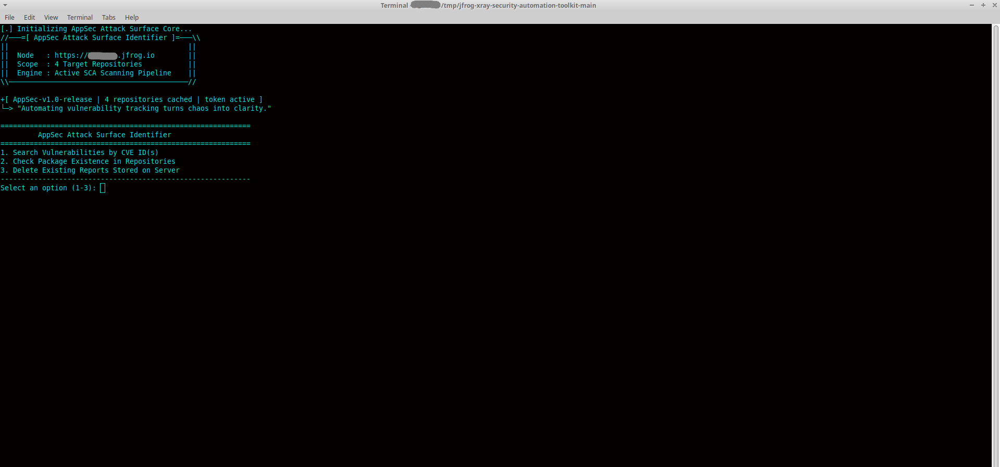
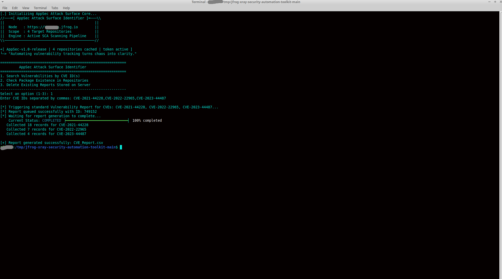
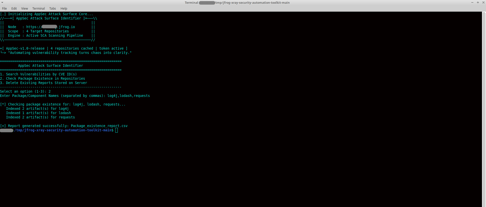
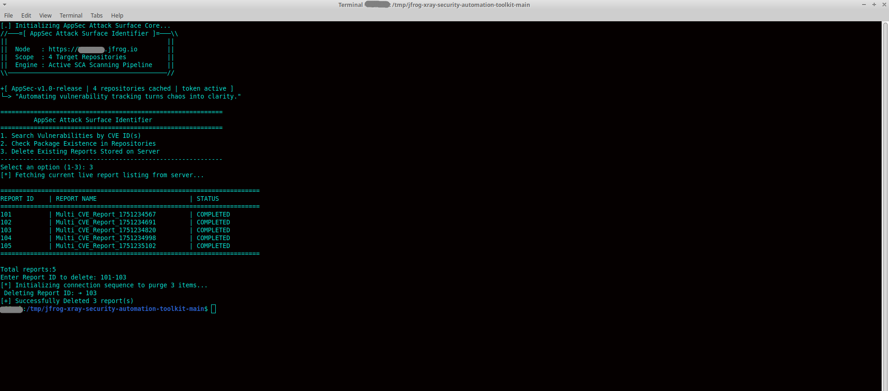
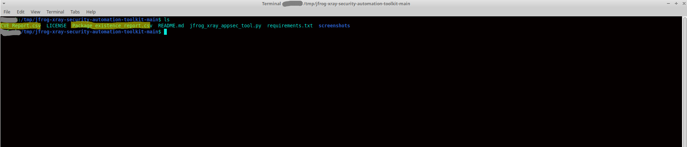

# JFrog Xray Security Automation Toolkit

A Python-based command-line toolkit for automating **JFrog Xray** vulnerability reporting, package analysis, and report management.

The toolkit simplifies common JFrog Xray operations by providing an interactive CLI for generating vulnerability reports, analyzing package versions across repositories, and managing stored reports.

---

## Features

- **Multi-CVE Vulnerability Report Generation**
- **Automated CSV Report Export**
- **Package Discovery Across Multiple Repositories**
- **Package Version & Security Context Analysis**
- **Bulk Report Management**
- **Authentication & Error Handling**

---

## Requirements

- Python 3.9+
- JFrog Artifactory
- JFrog Xray
- Valid JFrog Access Token

Install the required dependency:

```bash
pip install -r requirements.txt
```

---

## Configuration

Update the following values inside the script before execution.

```python
JFROG_URL = "https://YOUR_ORG.jfrog.io"
API_TOKEN = "YOUR_ACCESS_TOKEN"
```

---

## Usage

Run the script:

```bash
python jfrog_xray_appsec_tool.py
```

Select one of the available options:

```text
============================================================
         AppSec Attack Surface Identifier
============================================================

1. Search Vulnerabilities by CVE ID(s)

2. Check Package Existence in Repositories

3. Delete Existing Reports Stored on Server
```

---

# Screenshots

### Main Menu



### CVE Report Generation



### Package Discovery & Analysis



### Report Management



### Generated CSV Report



---

## Repository Structure

```text
jfrog-xray-security-automation-toolkit/
│
├── .gitignore
├── LICENSE
├── README.md
├── jfrog_xray_appsec_tool.py
├── requirements.txt
└── screenshots/
    ├── main-menu.png
    ├── cve-report-generation.png
    ├── package-discovery-analysis.png
    ├── report-management.png
    └── generated-csv-report.png
```

---

## Disclaimer

This project is intended for authorized JFrog administration, vulnerability management, and security automation. Use it only on systems and environments for which you have explicit authorization.

---

## License

This project is licensed under the MIT License.
